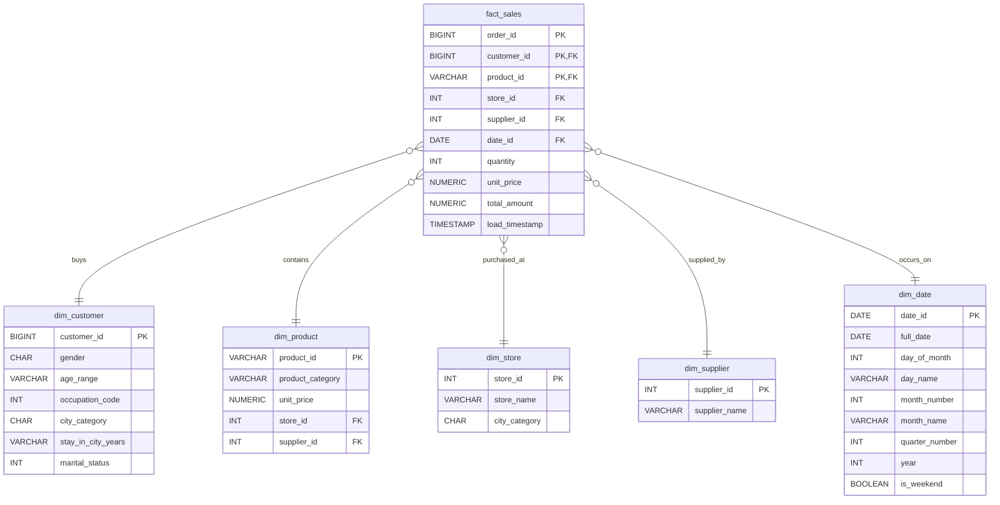

# 🛒 Walmart Near Real-Time Data Warehouse & HYBRIDJOIN ETL Pipeline

[](https://www.python.org/)
[](https://www.mysql.com/)
[](https://opensource.org/licenses/MIT)

An enterprise-grade, high-throughput ETL (Extract, Transform, Load) pipeline prototype designed to ingest point-of-sale streams, perform real-time master data enrichment using the **HYBRIDJOIN** algorithm, and load structured fact data into a star-schema MySQL data warehouse.

---

## 🎯 Project Overview

In high-volume retail environments like Walmart, transactions flow continuously from thousands of cash registers. Performing analytical queries directly on transactional databases degrades performance. 

This project solves this by streaming transaction data and enriching it on-the-fly with customer and product master data before loading it into a dedicated Data Warehouse. To achieve this under strict memory constraints, we implement a **HYBRIDJOIN** algorithm which balances in-memory hash tables with partition-based lookups.

### Key Architectural Pillars
- **High Ingestion Throughput**: Multithreaded producer-consumer model processes raw inputs concurrently.
- **HYBRIDJOIN Transformation**: Stream tuples are held in memory using a hash table and FIFO queue, while large customer master data is partitioned into buckets to minimize RAM footprint.
- **Idempotent Loading**: Batched database writes utilizing `ON DUPLICATE KEY UPDATE` to guarantee exactly-once/idempotent processing.
- **Star Schema Design**: Formatted for OLAP workloads, supporting 20 business intelligence queries.

---

## 📊 System Architecture

The pipeline consists of a decoupled, multithreaded architecture that minimizes I/O block times and optimizes CPU utilization.

```mermaid
graph TD
    subgraph Data Sources
        TS[transactional_data.csv]
        CM[customer_master_data.csv]
        PM[product_master_data.csv]
    end

    subgraph "ETL Engine (main.py)"
        direction TB
        subgraph Extraction
            Prod[Producer Thread]
            Queue[Stream Buffer Queue]
        end

        subgraph "Transformation (HYBRIDJOIN)"
            HT[In-Memory Hash Table]
            FIFO[FIFO Queue]
            Join[Join Engine]
        end

        subgraph Load
            OutBuf[Output Buffer]
            Loader[Batch Loader]
        end
    end

    subgraph Data Warehouse (MySQL)
        DB[(walmart_dw / salarkhan)]
    end

    TS -->|Stream Rows| Prod
    Prod -->|Push| Queue
    Queue -->|Consume| HT
    Queue -->|Track Arrival| FIFO
    CM -->|Load & Partition| HT
    PM -->|Load Lookup| Join
    HT & FIFO & PM -->|Enrich| Join
    Join -->|Accumulate| OutBuf
    OutBuf -->|Bulk Insert| Loader
    Loader -->|Load Fact & Dimensions| DB
```

---

## 🗄️ Data Warehouse Star Schema

The data warehouse uses a traditional **Star Schema** to simplify queries and optimize performance.



---

## 🔄 The HYBRIDJOIN Algorithm

HYBRIDJOIN is an advanced algorithm tailored for joining a fast-paced data stream with a large disk-based master relation. 

1. **Pre-loading & Partitioning**:
   - Product master data is cached in a quick O(1) hash map (`product_lookup`).
   - Customer master data is partitioned into `VP` (default: 2000) buckets using a hash-modulo function:
     `bucket_id = Customer_ID % VP`
     This structure represents disk partitions held in memory structure.
2. **Stream Buffering**:
   - The **Producer Thread** pushes incoming transaction rows to the `stream_buffer` queue.
   - The **Consumer (HybridJoin) Thread** pulls transaction rows and populates an in-memory hash table (`hash_table`) up to a threshold $HS$ (default: 50,000 transactions). A FIFO queue tracks the arrival order of customer IDs.
3. **Joining & Eviction**:
   - For the oldest customer ID in the FIFO queue, the algorithm fetches the customer's corresponding partition bucket from `customer_partitions`.
   - The transactions matching that customer are joined with customer details and product details.
   - Once processed, those stream transactions are evicted from the in-memory `hash_table`, freeing up space for subsequent transactions.

---

## 🚀 Performance Metrics

Under optimal settings, the ETL pipeline showcases the following performance footprint:
- **Extraction Rate**: ~100,000 rows/second
- **Join/Transformation Rate**: ~50,000 joins/second
- **Loading Rate (Local MySQL)**: ~25,000 rows/second
- **Total Peak RAM**: ~360 MB (highly lightweight)

---

## ⚡ Quick Start & Installation

### Prerequisites
- Python 3.10+
- MySQL Server 8.0+
- Client library: `pip install mysql-connector-python`

### 1. Database Setup
Ensure MySQL is running. Apply the schema definition using `DW.sql` or `salarkhan.sql`:
```bash
mysql -u root -p -e "CREATE DATABASE IF NOT EXISTS salarkhan;"
mysql -u root -p salarkhan < salarkhan.sql
```

### 2. Configure Credentials
Open [main.py](file:///d:/Semester%205/DAV%20Theory/HJ/SalarKhan_23i2607_Project/main.py) and update the `get_db_connection()` function with your MySQL credentials:
```python
def get_db_connection():
    return mysql.connector.connect(
        host="localhost",
        user="root",         # Your user
        password="yourpassword", # Your password
        database="salarkhan",
        autocommit=True
    )
```

### 3. Run the ETL Pipeline
Execute the main script to start streaming, transforming, and loading:
```bash
python main.py
```

Console logs will display real-time progress:
```text
[19:05:12] Loading Customers
[19:05:12] Customer batch 1: 5000 rows (total 5000)
...
[19:05:13] Loading Products
[19:05:13] Product batch 1: 3633 rows (total 3633)
[19:05:13] Dimension tables synchronized.
[19:05:14] Date dimension synchronized.
[19:05:15] Streaming & Joining
[19:05:15] Streamed 50,000 transactions...
...
[19:05:22] Inserted batch #1 (5000 rows)
[19:05:23] Reached limit of 1000 rows. Stopping hybrid join.
[19:05:23] ETL SUMMARY
[19:05:23] Streamed rows    : 550,000
[19:05:23] Enriched rows    : 1,000
[19:05:23] Batches inserted : 1
[19:05:23] ETL completed successfully!
```

---

## 📈 Business Intelligence & Analytical Queries

Once the data warehouse is populated, you can run the 20 analytical queries defined in [Queries.sql](file:///d:/Semester%205/DAV%20Theory/HJ/SalarKhan_23i2607_Project/Queries.sql). Key queries include:
- **Q1: Top-Selling Product Categories on Weekends**
- **Q5: Monthly Revenue Growth Rate**
- **Q10: Customer Lifetime Value (CLV) Segmentation**
- **Q16: Market Basket Analysis (Products frequently bought together)**
- **Q20: Supplier Performance and Shipping Volume Analysis**

To run these queries, log into MySQL and execute them:
```bash
mysql -u root -p salarkhan < Queries.sql
```

---

## 🔧 Tuning Configuration

You can tune the performance in [main.py](file:///d:/Semester%205/DAV%20Theory/HJ/SalarKhan_23i2607_Project/main.py) via configuration constants:

| Parameter | Default | Description |
| :--- | :--- | :--- |
| `HS` | `50000` | Max stream tuples kept in RAM |
| `VP` | `2000` | Number of customer hash partitions |
| `BATCH_SIZE` | `5000` | Chunk size for SQL batch inserting |
| `STREAM_DELAY` | `0.0` | Artificial sleep (seconds) between streamed rows (useful for real-time demos) |

---

## 📄 License
This project is licensed under the MIT License - see the LICENSE file for details.
